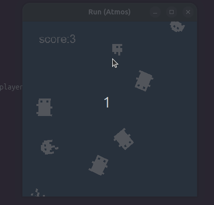
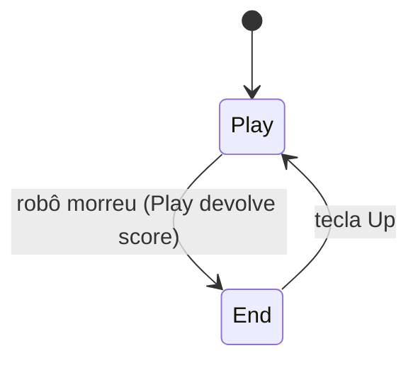
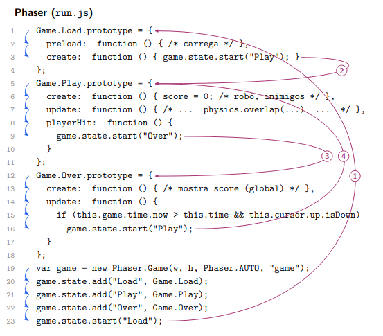
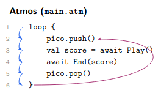
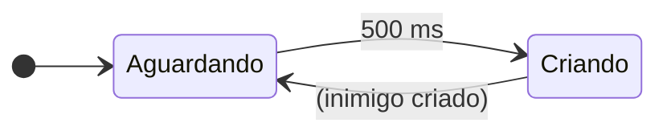
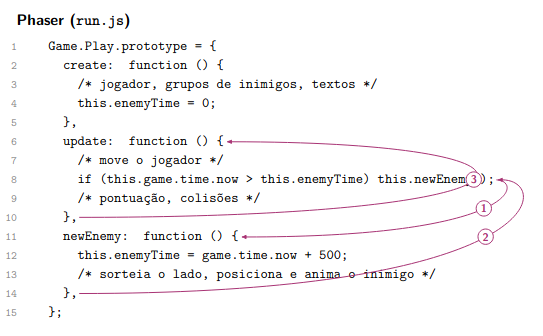
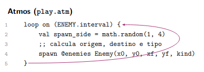

# Run



Port do jogo **Run!** do desafio *12 Games in 12 Weeks* (Lessmilk), de Phaser para a linguagem Atmos.

## Versões

| Ferramenta | Versão |
|---|---|
| **Atmos**| 0.8 |
| **pico-sdl** | 0.7 |
| **Phaser (original)** | 1.1.3 |

## Instruções

- O jogador controla um robô com as **setas** do teclado, nas quatro direções;
- A cada **500 ms** surge um inimigo de um lado arbitrário atravessando a tela em linha reta;
- O jogador ganha **1 ponto por segundo** enquanto estiver vivo.
- Colidir com o inimigo encerra a partida.

## 1. Fluxo das telas `main.atm`



No Phaser, o fluxo era dividido em três *states* (`Load`, `Play`, `Over`) alternados por `game.state.start(...)` e a pontuação residia em uma variável global. Em Atmos, o fluxo é lido como um laço infinito sequencial, e a pontuação é obtida com o valor de retorno de `Play` em cada iteração.




A transição entre as telas do Run é um caso do padrão de `continuation passing`: a conclusão de uma atividade longa carrega consigo a ação a ser executada em seguida. Na versão em Phaser, cada state carrega a indicação de qual será a próxima tela. Load termina com `game.state.start("Play")`, o callback playerHit dentro de Play chama `game.state.start("Over")` e Over devolve o controle a Play da mesma forma. A pontuação sobrevive a essas trocas pois está armazenada em uma variável global. **A ordem das telas não aparece em nenhum ponto do código e precisa ser reconstruida seguindo os saltos de um trecho do arquivo a outro**, como mostra a figura acima.

Em Atmos, essa leitura é sequencial e o único salto é a própria volta do laço.

## 2. Play `play.atm`

```
task Play () {
    pin enemies = tasks(ENEMY.max)  ;; pool de inimigos
    pin player  = spawn Robot() ;; o jogador
    var score   = 0

    spawn { ;; texto "use the arrow keys to move"
        par:any {
            ;; desenha o texto com transparência alpha
        } with {
            ;; espera tecla Up, faz o fade em LABEL_FADE e texto some
        }
    }

    par:any {
        ;; a cada SCORE_PERIOD soma score + 1
    } with {
        ;; desenha o placar
    } with {
        ;; a cada ENEMY.interval sorteia lado de surgimento e tipo de inimigo
    } with {
        ;; verifica se houve colisão entre player e inimigos -> emit @player :dead
    } with {
        ;; espera o robô terminar (await player) e toca o som de batida
    }
    score   ;; score é repassado como valor de retorno
}
```


## 3. Robot `robot.atm`

```
task Robot () {
    par:any {
        ;; espera :dead (vindo de Play quando há colisão)
    } with {
        ;; controla movimento
    } with {
        ;; controla direção do sprite
    } with {
        ;; desenha o robô
    }
}
```

---

## 4. Enemy `enemy.atm`

```
task Enemy (x0, y0, xf, yf, kind) {
    watching until (out_of_screen()) {  ;; termina quando sai da tela
        par {
            ;; movimento (atravessa a tela em ENEMY.travel segundos)
        } with {
            ;; a cada ENEMY.anim alterna o quadro da animação
        } with {
            ;; desenha rotacionado na direção do movimento
        }
    }
}
```

Ao terminar, a task sai do pool `enemies`. No Phaser isso era feito manualmente com
`outOfBoundsKill` e `getFirstExists(false)` (reaproveitamento de sprites).

---

## 5. End `end.atm`

```
task End (score) {
    par:any {
        ;; desenha "Game Over", a pontuação e a instrução
    } with {
        ;; espera o usuário apertar Up para reiniciar a partida
    }
}
```

---
# Padrões

## Hierarquia de Despacho
As entidades do jogo formam uma hierarquia em que uma pode conter outras. Quando uma informação chega, como a ocorrência de um evento ou a passagem de um quadro (update), ela precisa ser repassada em cadeia até as entidades mais internas (filhas). Sant'Anna (2018) chama esse padrão de hierarquia de despacho (dispatching hierarchy).

Frameworks têm uma parte já implementada, como o game loop e funcionalidades comuns às aplicações do domínio, e outra que precisa ser escrita pelo programador. Nesse sentido, **o framework absorve parte da complexidade daquilo que ele próprio sabe fazer**. Comportamentos que fogem do que ele oferece precisam ser escritos à mão de forma que o conceito ainda precisa ser conhecido pelo programador para que ele seja capaz de implementa-los. O custo é reduzido, mas nunca zerado.

No caso da hierarquia de despacho, o Phaser já oferece a cada objeto, por exemplo, o que é preciso para movê-lo, animá-lo e desenhá-lo. Quando uma entidade tem regras próprias do jogo, como inverter o sentido da direção ao bater na borda da tela, o programador precisa adicionar o repasse dessa informação no código.

No Phaser, **parte da hierarquia de despacho só é visível no código do próprio framework**. A ordem de atualização dos objetos, tweens e o código do jogo a cada quadro só aparece no código-fonte, mudou entre as versões verificadas (1.1.3 e CE 2.20.2) e não é descrita na documentação. Ainda assim, a documentação do Phaser CE deixa explícito ao programador que esse repasse é responsabilidade dele: "Remember if this Game Object has any children you should call update on those too".

Run não tem hierarquia de despacho **explícita** no código em Phaser. Ou seja, o programador não especificou nada que o framework já não tenha fornecido como funcionalidade. O movimento dos inimigos via tween, a animação, a remoção fora da tela com `outOfBoundsKill` e o desenho são repassados a cada objeto pelo próprio Phaser. Até a colisão com `physics.overlap` tem o grupo percorrido pelo Phaser. **A hierarquia de despacho ocorre apenas do lado do framework**.

Em Atmos, **cada entidade é uma task capaz de especificar e aguardar os eventos aos quais reage**, de modo que o despacho em cadeia deixa de ser necessário.

## Máquinas de Estado
(desenvolver)
FSM da criação de inimigos


A versão 1.1.3 do Phaser, usada em nove dos doze jogos, ainda não oferecia temporizadores (`game.time.events`). Então, o mecanismo de controlar prazos com uso de variáveis testadas a cada update também apareceu em outros jogos da série. 




Quando o prazo estoura (1), o update chama newEnemy. newEnemy ajusta o prazo e retorna (2). No quadro seguinte, o update é chamado novamente pelo topo (3). Como enemyTime inicia em zero, o primeiro teste já é verdadeiro. create e update rodam quando chamados pelo framework e newEnemy pelo update. Em Atmos, esse comportamento fragmentado é reconciliado em 1 linha.
